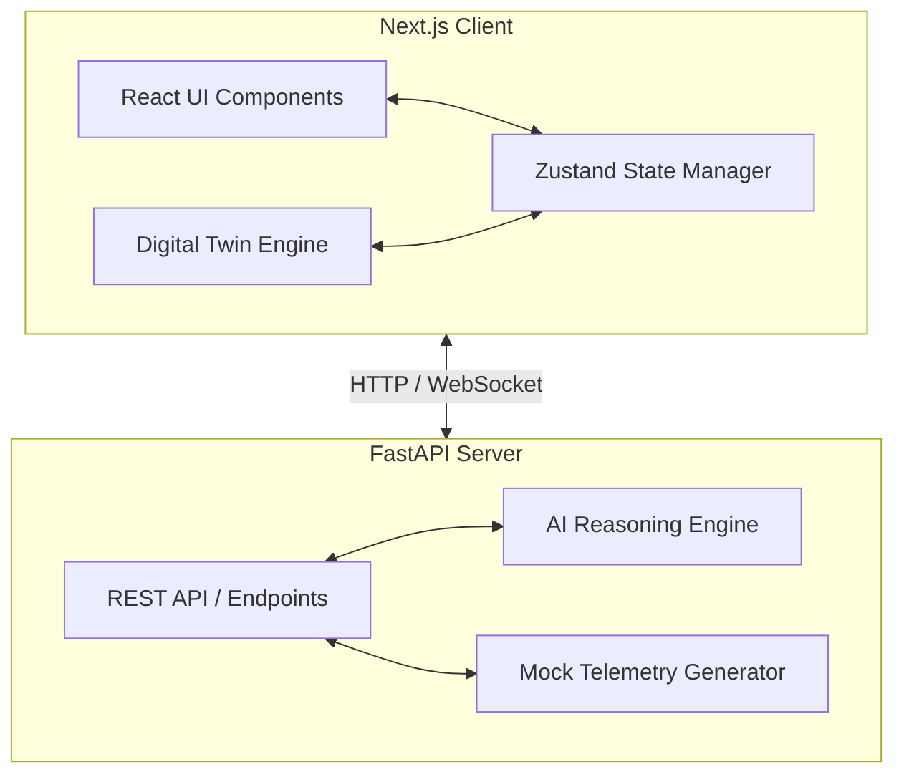

# Architecture

NagarNetra AI relies on a heavily decoupled frontend and backend architecture, connected via REST APIs and WebSockets, utilizing a highly optimized 3D rendering pipeline for the browser.

## High-Level System Diagram

## Digital Twin Engine (React Three Fiber)

The centerpiece of NagarNetra AI is the 3D Digital Twin, running natively in the browser via WebGL. 
To achieve 60 FPS while rendering thousands of dynamic entities, we utilize the following optimization strategies:

1. **Procedural Graph Generation (`useCityEngine.ts`)**
   - The city is represented mathematically as a Directed Graph of nodes (intersections) and edges (roads).
   - Splines are calculated once at initialization to determine smooth paths for vehicles.
2. **`InstancedMesh` Rendering**
   - Rather than rendering 600 individual vehicle `Mesh` components, we use a single `InstancedMesh` for each vehicle type (Sedan, SUV, Bus, Truck, Emergency).
   - In the `useFrame` loop, we manipulate a `Dummy Object3D` and update the transformation matrix buffer directly in memory. This skips React's reconciliation process entirely for vehicle positions, yielding massive performance gains.
3. **No External Asset Dependencies**
   - All geometries (Buildings, Roads, Vehicles) are built procedurally using Three.js primitives (`BoxGeometry`, `PlaneGeometry`, `CylinderGeometry`).
   - This eliminates network latency associated with downloading large `.glb` files and reduces the bundle size significantly.

## AI Reasoning Engine

The AI backend does not operate as a standard "chatbot." It functions as an **Agentic Workflow Pipeline**:
- **Observe**: Collects telemetry across 12 infrastructure systems.
- **Analyze**: Detects statistical anomalies (e.g., congestion spikes, anomalous power draw).
- **Predict**: Forecasts downstream impact (e.g., predicted gridlock in 15 minutes).
- **Recommend**: Formulates concrete, actionable mitigations.
- **Simulate**: Tests the recommendation against the Digital Twin models.
- **Execute**: Modifies state upon operator approval.
- **Learn**: Persists the outcome to improve future confidence scoring.

## State Management

We use `Zustand` to orchestrate global state cleanly without prop drilling. 
The state is intentionally split to prevent unnecessary re-renders:
- `useDigitalTwinStore`: Manages the camera preset, time of day, weather, and selected 3D entities.
- `useAIEngineStore`: Manages the AI reasoning pipeline stage, active hotspots, and incoming recommendations.
